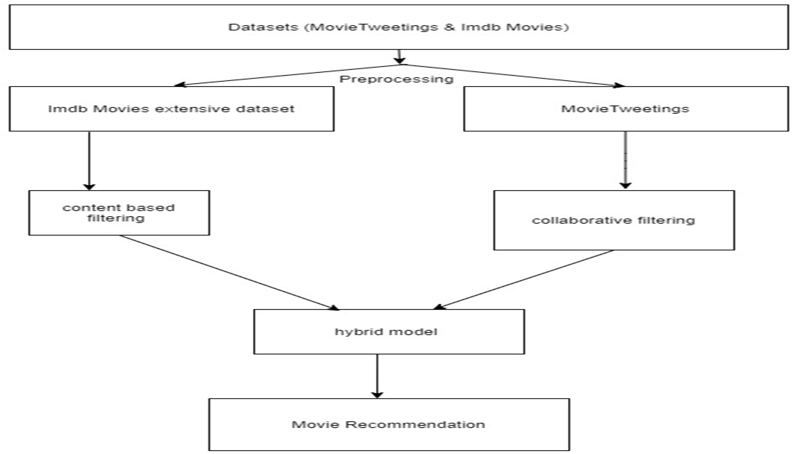
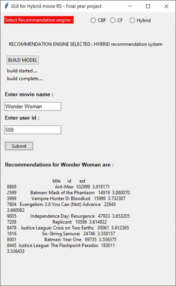

# Hybrid-Movies-Recommendation-System
Hybrid Movie Recommender system that uses concepts of 2 of the most popular recommender techniques: Collaborative and Content-based Filtering. These techniques are different in the approach they use to recommend items like Content-based Filtering uses some of the meta data about the item (movie in our case). The Collaborative Filtering model uses the users likes and dislikes to recommend movies, and the hybrid system uses both the approaches to give us high precision prediction.

## The datasets used

* MovieTweetings dataset
* IMIDB dataset

## System Architecture

## Content Based filtering

* Data Preprocessing
* Text vectorization
* Cosine Similarity matrix
* Get recommendation

## Collaborative filtering

* SVD (Singular Value Decomposition)

## Hybrid Recommendation system

Hybrid approach to the recommender system involves combining two of the most well-knowntechniques Content based and Collaborative filtering into one single model that has the features of both the techniques. Here’s how it works, we form a batch set from the whole data set that get recommended using CBF technique i.e., we find top 25 from the dataset that are similar to the movie given as input using the cosine similarity model in the CBF technique and apply collaborative approach wherein we find the users that have similar interest as the input user, and then pick out the top 10 movies out of the 25 using the estimate factor.

## Sentiment Analysis

Sentiment analysis is a core of the hybrid implementation as we are optimizing the results gotten by the model using sentiment analysis hence locating the tweets, gathering them and using the VADER algorithm for analysis and to find the sentiment rating is a task and updating the results each day would make it more difficult, that is why the dataset MovieTweetings is used.

The MovieTweeting dataset is an open-source research project that has a system set up that locates, gathers and analyses the tweets for sentiment scores and also updates the dataset each day so that whatever data is contained is new and cannot be ruled out as old and unusable.

The system that’s set up uses keywords to search for the movie and/or uses the the “#IMIDB” for searching some of the ratings that the users rate on IMIDB platform, all these (the direct rating form IMIDB and sentiment analysis) are considered and cumulatively used to find the actual average sentiment rating that is recorded in the Ratings.dat file of the dataset. The dataset contains 3 files:

* movies.dat: This file contains the movieId, movie title and the genre of the movie
* users.dat: This file contains the userId, and the twitterId of the user
* ratings.dat: this file contains userId, movieId, rating(calculated using sentiment analysis) and the rating timestamp.

One of few popular and reliable techniques used to find the sentiment scores using the text is called Valence Awareness Dictionary for sentiment REsoning (VADER). VADER is sensitive to both polarity (whether the sentiment is positive or negative) and Intensity (how positive or negative is sentiment) of emotions, hence the pre-processed data/tweets from the gingerit function is taken as the input to this algorithm.
    
    
 ## GUI for movie recommendation using Tkinter

## Purpose of the project

Myself and my teamates(3 others) have developed this project during our final academic year of computer scinece engineering in fulfillment for the award of degree of
BACHELOR OF ENGINEERING from Visvesvaraya Technological University (VTU).

## Conclusion 

The Hybrid model’s result is optimized as we use MovieTweetings dataset for the collaborative filtering part of and this dataset is an open-source dataset that is mode specifically for sentiment-based movie recommender. In future, we plan to make this system more accurate and platform for listing out movies with their metadata, where users can rate movie and get more accurate recommendation. This will help us to maintain user profiles more precisely. Currently our models support only English movies, in future we will add dataset of regional movies.
